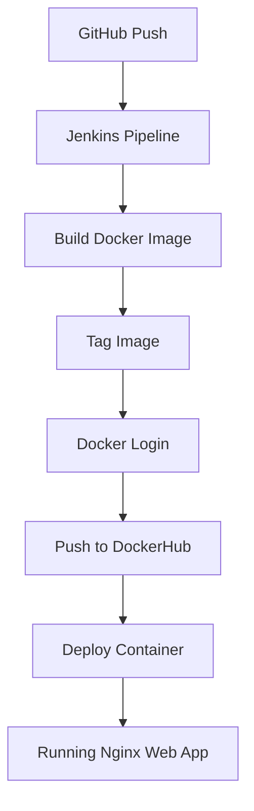

# Static Web CI/CD Pipeline using Jenkins, Docker, and Nginx

## Project Overview
This project demonstrates a fully automated CI/CD pipeline for a static web application. It automates the process of pulling code from GitHub, building a Docker image using Nginx, tagging it, pushing it to Docker Hub, and finally deploying the container automatically on an AWS EC2 instance.

## Tech Stack
- **CI/CD:** Jenkins
- **Containerization:** Docker
- **Web Server:** Nginx
- **Version Control:** GitHub
- **Scripting:** Bash scripting
- **Infrastructure:** AWS EC2 (single instance)

## Pipeline Explanation
The pipeline consists of the following exact stages:
1. **Pull Source Code:** Clones the repository code from GitHub (`https://github.com/01Sachinc/java-fullstack-devops-app.git`).
2. **Build Docker Image:** Builds the Docker image locally (`docker build -t webapp .`).
3. **Tag Docker Image:** Tags the local image with the Docker Hub repository format.
4. **Docker Login:** Securely authenticates with Docker Hub using Jenkins credentials.
5. **Push Docker Image:** Pushes the tagged image to Docker Hub.
6. **Deploy Container:** Checks if the container is already running. If it exists, it stops and removes the old container, then runs a new one on port 80.

## Architecture Diagram


## Setup Instructions

### 1. EC2 Instance Preparation
1. Launch an AWS EC2 instance (Ubuntu/Amazon Linux).
2. Install Docker:
   ```bash
   sudo apt update
   sudo apt install docker.io -y
   sudo usermod -aG docker jenkins
   sudo usermod -aG docker ubuntu
   sudo systemctl enable docker
   sudo systemctl start docker
   ```
3. Install Jenkins:
   ```bash
   sudo apt install openjdk-17-jre -y
   curl -fsSL https://pkg.jenkins.io/debian/jenkins.io-2023.key | sudo tee /usr/share/keyrings/jenkins-keyring.asc > /dev/null
   echo deb [signed-by=/usr/share/keyrings/jenkins-keyring.asc] https://pkg.jenkins.io/debian binary/ | sudo tee /etc/apt/sources.list.d/jenkins.list > /dev/null
   sudo apt-get update
   sudo apt-get install jenkins -y
   ```

### 2. Jenkins Setup
1. Open Jenkins at `http://<EC2-IP>:8080` and complete the initial setup.
2. Install necessary plugins: Docker Pipeline, Git.
3. Add Docker Hub credentials:
   - Go to **Manage Jenkins** > **Credentials** > **System** > **Global credentials**.
   - Click **Add Credentials**.
   - Kind: **Username with password**
   - Username: `01sachinc`
   - Password: `<your_dockerhub_token_or_password>`
   - ID: `docker-hub-credentials`
   - Description: Docker Hub Credentials
4. Create a new Pipeline Job:
   - Name: `Static-Web-Pipeline`
   - Select **Pipeline** and click OK.
   - In the Pipeline section, select **Pipeline script from SCM**.
   - SCM: **Git**
   - Repository URL: `https://github.com/01Sachinc/java-fullstack-devops-app.git`
   - Script Path: `Jenkinsfile`
   - Save and Build Now.

### 3. Important Docker Commands Used
- `docker build -t webapp .`
- `docker tag webapp 01sachinc/webapp:latest`
- `docker login -u $USERNAME -p $PASSWORD`
- `docker push 01sachinc/webapp:latest`
- `docker ps -a`
- `docker stop webapp`
- `docker rm webapp`
- `docker run -d -p 80:80 --name webapp 01sachinc/webapp:latest`
