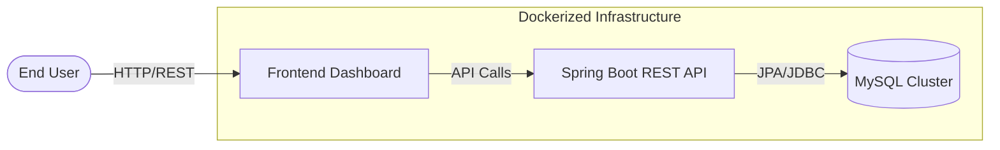
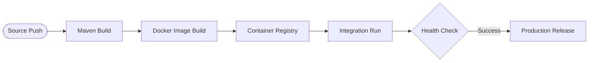

# DevOps Task Manager – Enterprise Java Orchestration 🚀

Architected by **Sachin C S** | Cloud & Infrastructure Specialist

---

## 💎 Project Essence

The **DevOps Task Manager** is a high-performance, full-stack ecosystem engineered to showcase the convergence of modern Java development and industrial-strength DevOps.

This project demonstrates a complete **Stateful Delivery Lifecycle**—incorporating a layered Spring Boot API, a premium responsive UI, and a fully automated CI/CD engine orchestrated via Docker and GitHub Actions.

---

## 🏗️ Technical Architecture

### 🛠️ Ecosystem Visualization



### 📈 Deployment Lifecycle



---

## ☁️ Backend Engineering (Java Spring Boot)

The service layer is built on a **Modular Layered Architecture**, ensuring high availability and decoupled logic:

- **RESTful Endpoints**: Full CRUD capabilities for task states (`/api/tasks`).
- **Service Orchestration**: Decoupled business logic for transaction management.
- **Persistence Layer**: Spring Data JPA with MySQL optimization.

---

## 📦 Containerization & Orchestration

The entire application lifecycle is codified via **Docker**, ensuring absolute environment parity:

- **Application Node**: OpenJDK 17 image optimized for low-latency execution.
- **Data Persistence**: Managed MySQL volumes for durable state storage.
- **High-Velocity Networking**: Orchestrated via Docker Compose for inter-service communication.

---

## 🤖 CI/CD & Automation

A custom automation suite ensures a zero-fault deployment pipeline:

- **Bash Automation**: Modular scripts (`build.sh`, `deploy.sh`, `monitor.sh`) for lifecycle management.
- **GitHub Actions**: Automated Maven packaging, image tagging, and proactive health scanning.

---

## 🚀 Execution Logic

### Prerequisites

- **Java 17+** & **Maven**
- **Docker** engine
- **Bash**-compatible terminal

### Start Sequence

```bash
# 1. Initialize Context
git clone https://github.com/01Sachinc/java-fullstack-devops-app.git
cd java-fullstack-devops-app

# 2. Grant Permissions
chmod +x scripts/*.sh

# 3. Launch Enterprise Stack
./scripts/build.sh
./scripts/deploy.sh
```

---

## 👨‍💻 Author

**Sachin C S**  
AWS Cloud & DevOps Engineer | Infrastructure Automation Specialist

📧 **Email**: [cssachin83@gmail.com](mailto:cssachin83@gmail.com)  
📱 **Phone**: +91 8496001030  
🌐 **Links**: [LinkedIn](https://www.linkedin.com/in/sachin-c-s/) | [GitHub](https://github.com/01Sachinc)

---

## 📜 License

MIT License. Created for professional portfolio demonstration.
