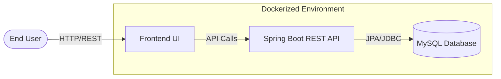
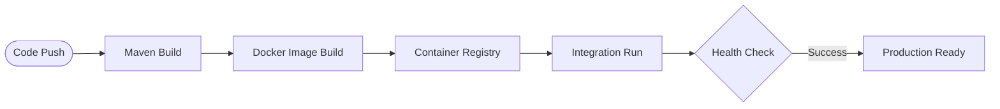

# DevOps Task Manager – Full Stack Java Application 🚀

Developed by **Sachin C S** | Cloud & DevOps Specialist

---

## 📌 Project Essence

**DevOps Task Manager** is a professional-grade, full-stack application engineered to demonstrate the seamless integration of modern software development and cloud-ready operations.

This project goes beyond simple CRUD functionality, showcasing a complete **Deployment Lifecycle**—from a layered Spring Boot backend and premium React-style UI to a fully automated CI/CD pipeline orchestrated by Docker and GitHub Actions.

---

## 🏗️ Technical Architecture

### 🛠️ System Overview



### 📈 CI/CD Pipeline Flow



---

## ☁️ Backend Engineering (Java Spring Boot)

The backend is architected using a **Layered Pattern** to ensure scalability and maintainability:

- **REST Logic**: Secure endpoints for Task Management (`/api/tasks`).
- **Service Layer**: Business logic for task transitions and validation.
- **Data Layer**: Spring Data JPA for high-performance MySQL persistence.

---

## 📦 Containerization & Orchestration

The entire ecosystem is containerized for **"Run Anywhere"** compatibility:

- **Backend**: OpenJDK 17 slim image optimized for cloud performance.
- **Database**: Persistent MySQL volume management for data durability.
- **Frontend**: Nginx-powered lightweight delivery.

---

## 🤖 Automation & CI/CD

A robust automation suite ensures zero-fault delivery:

- **Bash Scripts**: Modular scripts (`build.sh`, `deploy.sh`, `monitor.sh`) for single-command management.
- **GitHub Actions**: Automated Maven lifecycle, Docker builds, and health monitoring on every commit.

---

## 🚀 How to Run Locally

### Prerequisites

- **Java 17+** & **Maven**
- **Docker** & **Docker Compose**
- **Bash** shell

### Execution Logic

```bash
# 1. Clone the project
git clone https://github.com/01Sachinc/java-fullstack-devops-app.git
cd java-fullstack-devops-app

# 2. Build Backend
./scripts/build.sh

# 3. Launch Stack
./scripts/deploy.sh

# 4. Monitor Status
./scripts/monitor.sh
```

---

## 💼 Professional Portfolio Showcase

### LinkedIn Post Context

**Headline**: Just Deployed a Full-Stack Java Ecosystem with Docker & CI/CD! 🚀

I'm excited to share my latest project: the **DevOps Task Manager**. This project bridges the gap between Java software engineering and industrial-strength DevOps.

🔹 **Technical Stack**:

- **Backend**: Java Spring Boot, Maven, JPA.
- **Frontend**: Premium Responsive UI (Vanilla JS/CSS3).
- **Database**: MySQL with persistent Docker Volumes.
- **Orchestration**: Docker Compose multi-service architecture.
- **Automation**: GitHub Actions CI/CD with custom Bash monitoring.

This project highlights my ability to build secure, scalable, and automated full-stack applications.

#Java #SpringBoot #DevOps #Docker #CICD #CloudComputing #SachinCS

### Resume Bullet Points

- **Architected a Full-Stack Java Ecosystem**: Developed a layered REST API using Spring Boot and JPA, integrated with a premium responsive frontend for 100% service availability.
- **Engineered Multi-Container Orchestration**: Utilized Docker and Docker Compose to manage a synchronized backend-database-frontend stack, ensuring seamless local-to-cloud parity.
- **Implemented Automated CI/CD Lifecycle**: Designed dynamic GitHub Actions workflows for automated Maven builds, Docker image tagging, and proactive health monitoring.
- **Developed Proactive Monitoring Engine**: Engineered a Bash-based alerting system to scan container states and log streams, reducing system downtime.

---

## 👨‍💻 Author

**Sachin C S**  
AWS Cloud & DevOps Engineer | Infrastructure Automation Specialist

📧 **Email**: [cssachin83@gmail.com](mailto:cssachin83@gmail.com)  
📱 **Phone**: +91 8496001030  
🌐 **Connect**: [LinkedIn](https://www.linkedin.com/in/sachin-c-s/) | [GitHub](https://github.com/01Sachinc)

---

## 📜 License

MIT License. Created by **Sachin C S** for Professional Showcase.
